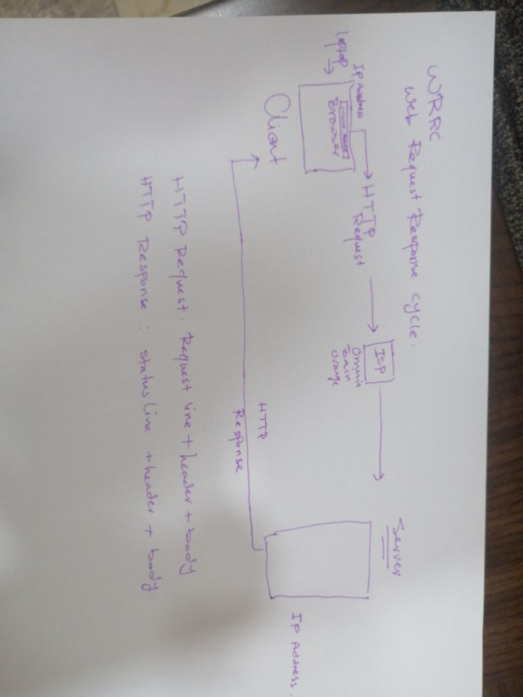
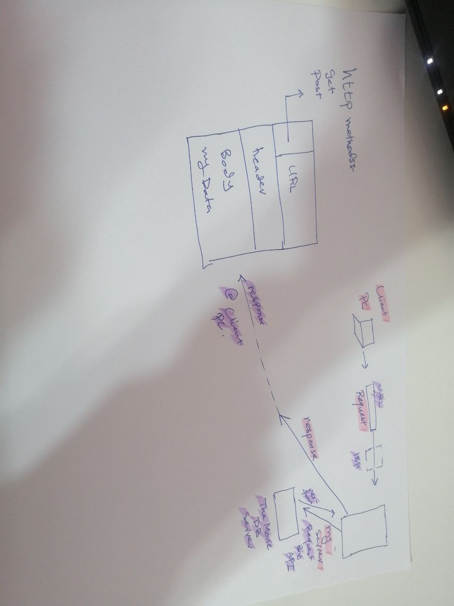

# Movies-Library - 01

**Author Name**: Ayat Alkayed

## WRRC

## Overview
A server for a movie library was created.
## Getting Started
Clone the repo in his device.
in the terminal : npm init -y ,npm i express cors to download the required files that was ignored when pushed to GitHub.
check the available port in his device and change that in my code to the available for him and in the termenal npm start
if thers no problem with the port type this in the search bar of the browser :
https://localhost:(type here your available port number)
//to run this file run these commands in your PC termenal 
npm i express cors axios dotenv 
to open each page use the folloeing extensions 
hoem use '/' extension 
favorite page use '/favorite'
trending page use '/trending'
to search use '/search'
for networks use '/Networks'
gor reviews '/Reviews'
## Project Features
a library of movie and a favourite movies page.